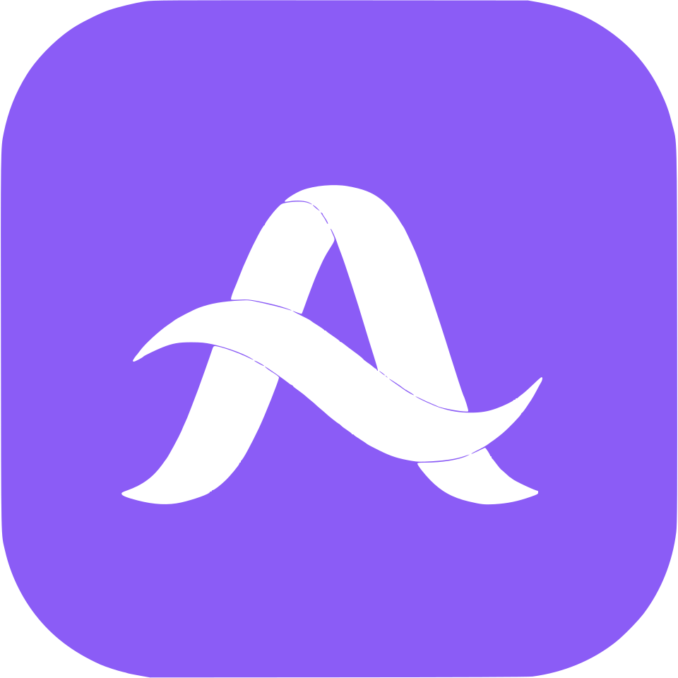

<div align="center">
  
  
</div>

A desktop AI assistant built with Electron, powered by [MiMo Code](https://github.com/XiaomiMiMo/MiMo-Code).

Aria Chat wraps the MiMo Code local server in a clean, Claude-desktop-style UI — four modes (including a live Web Agent that drives a real browser), real-time streaming, inline approvals, scheduler automation, voice input, application launcher, and a live workspace panel. No cloud dependencies; everything runs locally.

Built by [Junji at Project BomberCraft](https://github.com/gabrieljamh/Aria-Chat).

---

**Version: 2.0.2** — Web Agent mode with persistent click markers + offscreen enforcement, true per-session multitasking, on-device voice transcription, interactive bash terminal, application launcher, tray + autostart, auto-update, and a hardened attachment pipeline.

## Features

### Four Modes

- **Chat mode** — throwaway sandboxed conversations. Each chat gets its own isolated folder so file operations never touch your real projects.
- **Tasker mode** — point at a project folder and describe a task. A live **Progress** checklist and **Files** panel track what the agent creates or edits alongside the conversation. Includes project dropdown, sidebar tree, DiffGrid visualization, favorites/pinning, and session rename/delete with server sync.
- **Scheduler mode** — automate your workflow with recurring rules. Configure triggers (on-startup, interval, daily, weekly), targets (sandbox, project, none), and actions (AI prompt, bash command, detached background process, desktop notification, MCP tool call). Live stats panel tracks success/running/failed runs, history log, and kill-by-PID for background processes.
- **Web Agent mode** *(experimental)* — hand a real browser to the agent. A 3-column layout (sidebar + URL bar + chat panel) renders a live Electron `BrowserView` the agent drives via 13 tools (`browser_click`, `browser_type`, `browser_screenshot`, `browser_getdom`, `browser_scroll`, `browser_drag`, `browser_draw`, `browser_navigate`, `browser_keystrokes`, `browser_zoom`, `browser_copy`, `browser_paste`, `browser_hold_key`). Lazy session creation, per-session browser views, model selector in the tab head, and a fullscreen hero with greeting + suggestion chips. Gated by the `MIMOCODE_EXPERIMENTAL_WEB_AGENT` flag and a Settings toggle.

### Core Capabilities

- **Real-time streaming** — tokens, tool calls, reasoning, and file changes stream live over SSE.
- **True per-session multitasking** — a per-session state registry means switching tabs preserves in-flight conversations: no refetch flash, no busy-state loss, no mode leak. Sidebar busy indicators (pulsing accent dot) show which sessions are mid-turn, and per-session agent tracking keeps the mode dropdown in sync with server-driven agent switches.
- **Inline approvals** — permission requests appear as cards in the conversation. Approve once, always allow, or deny without leaving the flow.
- **Multiple model/providers** — the model selector is populated live from the server with searchable/filterable dropdowns. Add any OpenAI-compatible provider with an API key and base URL. Models can be added to an existing provider via a dropdown + protocol picker, and the add-model dropdown shows the provider ID (not the model count) for unambiguous selection.
- **Multi-modal input** — attach images, audio, video, PDFs, and files via the composer. Vision/audio/video model redirects let you route attachments to specialized models. A describe-and-inject fallback describes images to non-vision models (including tool-result screenshots) so webagent flows keep working even when the active model can't view image parts.
- **Voice transcription (STT)** — on-device speech-to-text via local Whisper. Record voice memos in the composer and Aria transcribes them to text in-place — no cloud, no API key, model-agnostic.
- **Attachment hardening** — reliable voice recording capture, binary/archive spill to temp (multi-MB text files no longer overflow a request; they're written to `tool-output/` and replaced with a head preview + read-tool hint), and drag-drop validation.
- **Archive extraction** — attach `.zip`, `.tar`, `.tar.gz`/`.tgz`, `.7z`, `.rar`, or `.gz` archives and Aria extracts them server-side, inlining text files (up to 20 files / 500KB) and listing binary contents. Uses system tools (`Expand-Archive`, `tar`, `7z`, `unrar`) with `Bun.gunzipSync` for single `.gz` files. Graceful error messages when extraction tools aren't installed.
- **Interactive bash terminal** — when the AI calls `bash` with `interactive: true`, the server emits a `bash.interactive.asked` SSE event and blocks on a Deferred. A TerminalModal (xterm.js + FitAddon) opens in the renderer with the live terminal; Abort/Send&Close actions resolve the Deferred and unblock the AI. The PTY WebSocket is held in the main process (browser WS can't set custom auth headers), with a one-time connect ticket.
- **Application launcher** — the AI can launch registered applications via the `run_app` tool. Windows launches go through `cmd.exe` (`shell: true`) for `.bat`/`.cmd`/`.ps1`/`.lnk` resolution, with paths quoted as a single command-line string (avoids Node's `DEP0190`). Protocol URIs (`steam://run/<appid>`, `mailto:`, `vscode://`) route to the OS-registered handler via `shell.openExternal`. The Settings → Applications page lets you register apps via file picker (extended with `.lnk`/`.url`) or a manual-paste path/URL row that derives the name from the URL tail.
- **Custom instructions** — per-conversation guidance saved into the global server config.
- **Auto-compaction** — keep long conversations within context limits with configurable token thresholds and an optional dedicated model.
- **Skills** — extend the agent with installable skill packs (`.skill` files, SKILL.md folders).
- **MCP integration** — Model Context Protocol server connections managed from Settings. Exposes `listTools` and `callTool` for use in Scheduler rules and agent conversations.
- **Settings** — General, Conversations, Models, Providers, Applications, Skills, MCP, Server, and About pages with full configuration.
- **System notifications** — configurable notifications for approvals, questions, and idle state with per-type toggles and warm, personalized copy. Idle-notification race fixed so the "response complete" ping never fires on a still-busy session.
- **Accent color theming** — choose any hue, with auto-dark/light text detection on accent backgrounds, optional cycling mode, and a hidden RGB easter egg.
- **GitHub integration** — configure GitHub username and personal access token in Settings > General for authenticated git push.
- **AI greetings & suggestions** — personalized, AI-generated greetings and suggestion cards per mode (toggle in Settings). Scheduler suggestions infer trigger/action from keyword matching. WebAgent greetings are trimmed to a single short line so the hero stays compact.
- **Context menu** — right-click messages for copy, copy selected, delete, fork, and regenerate actions.
- **Syntax-highlighted file viewer** — preview files with highlight.js syntax highlighting and media/image lightbox.
- **Auto-update** — built-in updater checks for new releases on launch or on demand from Settings; downloads and installs portable builds.
- **Tray + autostart** — Aria minimizes to the system tray (close button hides by default). Shift+Click or Ctrl+Click on the close button quits the app completely instead of hiding (the button turns red while a modifier is held, with a tooltip change). Single-instance lock uses `app.exit(0)` so a second launch dies before flashing a window or restarting the embedded server.
- **Cached dev binary** — `npm run dev` caches the compiled `mimo.exe` and only rebuilds when server sources change, so dev startup is instant instead of 5-15s of JIT-compile. Auto-rebuilds on source file changes.

### Web Agent diagnostics

The Web Agent mode includes two features that help the model self-diagnose unreliable coordinates and offscreen clicks:

- **Persistent click markers** — `browser_click` / `browser_drag` / `browser_type` (with `elementId`) paint a red crosshair marker at the exact page-CSS coordinates where the input event landed. The marker persists in the page DOM until the next `browser_screenshot` is captured, so the screenshot shows where the prior `(x, y)` actually landed — the model can verify "my coordinates were off by N pixels" and recalibrate. After capture the markers are cleared, so the next screenshot starts fresh.
- **Offscreen element enforcement** — `elementCenter` now reports `inViewport`. The click/type/drag handlers reject elementId endpoints whose resolved coordinates are offscreen with a clear `Element ... is offscreen — use browser_scroll to bring it into view, then re-screenshot and retry` error, instead of silently no-op'ing on offscreen coordinates. `browser_getdom` output tags offscreen elements with `[OFFSCREEN]` so the model can tell upfront. Tool descriptions across click/type/drag/scroll/getdom enforce the scroll-first workflow.

## Getting started

### Prerequisites

- **Node.js 18+** and **npm**
- **Bun** (used to launch the MiMo Code server)

### Install & run (dev)

```bash
# 1. Clone the repo
git clone https://github.com/gabrieljamh/Aria-Chat.git
cd Aria-Chat

# 2. Install monorepo deps (Bun)
bun install

# 3. Install desktop app deps
cd desktop
npm install

# 4. Run in dev mode
npm run dev
```

The app **auto-starts a local MiMo Code server** on `127.0.0.1` with a random port. A splash screen shows progress until the server is ready. The dev binary is cached for instant subsequent startups; it rebuilds automatically when server sources change.

### Enabling the Web Agent mode

The Web Agent is experimental and gated by a server flag. Launch with:

```bash
MIMOCODE_EXPERIMENTAL_WEB_AGENT=1 npm run dev
```

Then toggle **Settings → General → Experimental → Web Agent** to add the Web Agent tab.

### Attaching to an already-running server

Run the server yourself:

```bash
# from the repo root
bun run --conditions=browser packages/opencode/src/index.ts serve --port 4096
```

Then open **Settings → Server** in the app and set the URL to `http://127.0.0.1:4096`, or launch with:

```bash
MIMO_SERVER_URL=http://127.0.0.1:4096 npm run dev
```

### Build a portable copy

```bash
cd desktop
npm run pack
```

This produces `dist-portable/` with `aria-chat.exe`, the Electron runtime, and the compiled server binary — no install needed. A zip archive is created alongside it. The portable build does NOT ship `node_modules/`, so any main-process dependency that's externalized by `externalizeDepsPlugin` must be excluded (currently `ws` + `strip-ansi`), and `bufferutil` + `utf-8-validate` must be marked external (Rollup fails to resolve them when `ws` is bundled).

## Architecture

Aria Chat follows a strict three-layer Electron architecture:

```
Main Process (Node)          → spawns server, runs HTTP/SSE client, IPC bridge, BrowserManager, PTY relay
  ↓  contextBridge (window.mimo)
Preload                      → typed pass-through to IPC
  ↓  window.mimo.*
Renderer (React)             → UI only, never talks to the server directly
```

**Adding a server feature requires touching all three layers in lockstep:**
1. `src/shared/types.ts` — add the method to the `MimoApi` interface
2. `src/preload/index.ts` — wire it to `ipcRenderer.invoke`
3. `src/main/ipc.ts` — register the `ipcMain.handle` handler

See [`desktop/ARCHITECTURE.md`](./desktop/ARCHITECTURE.md) for the full module map, data flow, and state model.

### Web Agent architecture

The Web Agent runs a real Chromium instance via Electron `BrowserView`:

```
Renderer (WebAgentMode.tsx)  → URL bar, chat panel, suggestion chips
  ↓  IPC (webagent.* methods)
Main Process                 → BrowserManager (multi-session BrowserView registry)
  ↓  HTTP + Bearer secret
BrowserServer                → /navigate /screenshot /click /type /scroll /drag /draw /zoom /holdkey /getdom /copy /paste /state
  ↑  bridge.post("click", ...)
opencode BrowserBridge       → Effect service that posts to BrowserServer from the 13 browser_* tools
```

Each Web Agent sandbox gets its own `BrowserView`. The `BrowserServer` is an HTTP server on `127.0.0.1` with a random port and a random Bearer secret, so only the embedded opencode process can drive it. Click coordinates are normalized for HiDPI/zoom (screenshot pixels map 1:1 to click coordinates at any display scale and any page zoom).

## Server patches (required for the desktop app)

The upstream MiMo Code server is designed for a single TUI client. Aria Chat patches the server in a few places so that multi-instance desktop sessions work correctly. These changes live in `packages/opencode/` and must be preserved when merging upstream:

### 1. GlobalBus SSE subscription — `src/server/routes/instance/event.ts`

The stock server only subscribes to the local `Bus` for the request's directory instance. When the desktop app creates multiple sessions (chat sandboxes, tasker projects, web agent sandboxes), events from instances other than the repo root never reach the SSE stream — so streamed tokens, tool calls, and state updates silently disappear.

**Fix:** subscribe to `GlobalBus` in addition to `Bus`, so events from all instances are forwarded to the connected client. The `GlobalBus.on("event", onGlobal)` listener pushes each payload into the SSE queue; cleanup calls `GlobalBus.off` on disconnect. The SSE stream is kept alive for the lifetime of the directory, not killed on instance disposal.

### 2. Auto-compaction threshold — `src/config/config.ts` + `src/session/overflow.ts`

Upstream only supports compaction triggered by the model's reported context limit. The desktop app exposes a user-configurable **compaction threshold** (token count) so users can cap context at e.g. 100K regardless of the model's limit.

**Fix:** add `threshold` (optional `NonNegativeInt`) to the compaction schema in `config.ts`. In `overflow.ts`, `isOverflow()` and `pressureLevel()` check `compaction.threshold` first — if set, it overrides the model's reported limit as the trigger point and pressure-calculator denominator.

### 3. Prompt cache key gate — `src/provider/transform.ts`

Upstream set `promptCacheKey` for all of `openai` unconditionally, or whenever `providerOptions.setCacheKey` was truthy. This sends cache keys to providers that don't support them (causing errors or silent waste).

**Fix:** introduce `supportsPromptCacheKey` — an explicit allowlist (`venice`, `openrouter`, `opencode*`, `@ai-sdk/azure`, openai gpt-5). `promptCacheKey` is only set when `setCacheKey` is true **and** the provider is on the list. Additionally, the opencode-provider reasoning/reasoningSummary block now guards against `@ai-sdk/openai-compatible` (generic adapter shouldn't receive opencode-specific options).

### 4. TUI streaming race condition — `src/cli/cmd/tui/context/sync.tsx`

When a `message.part.updated` event arrives with text that's shorter than what delta accumulation has already built in the store, the full-part update would overwrite the accumulated (longer) text — visible as tokens momentarily disappearing during streaming.

**Fix:** in `sync.tsx`, if the incoming part is a text type and the store already has text that's equal or longer, skip the update (break instead of overwrite). Also handles out-of-order `message.part.delta` events by creating a placeholder part when the part isn't found yet.

### 5. Config schema leniency — `src/config/provider.ts`

Upstream schema requires `cost.input`, `cost.output`, `limit.context`, `limit.output` as required numbers. Existing configs with missing/undefined values cause validation failure on startup: `expected number, received undefined`.

**Fix:** make all numeric cost/limit fields optional in the `Model` schema. Server's existing fallback logic in `provider.ts` handles missing values: `limit.context` defaults to 1M tokens, `limit.output` defaults to 0, `cost.input/output` default to 0 (free tier marker). Also sanitize config on READ at startup — strips `undefined` from numeric fields before validation runs in the child process.

### 6. Rate limit error detection — `src/session/retry.ts`

Provider errors like Anthropic's `ResourceExhausted: Worker local total request limit reached (33/32)` arrive with HTTP 200 but error in response body. Upstream retry logic only checked HTTP status codes (429, 5xx), missing these body-only errors.

**Fix:** added pattern matching in `retryable()` and `isRateLimitMessage()` for `"worker local total request limit"`, `"resourceexhausted"`, `"quota exceeded"`, plus existing patterns. These are now recognized as retryable, triggering exponential backoff instead of showing "Stopped" immediately. The TUI upsell detector also uses `isRateLimitMessage()` to show the rate limit banner.

### 7. Provider edit preserves base config — `desktop/src/renderer/components/SettingsModal.tsx`

When editing a provider's model metadata (limits/pricing/capabilities), the old code sent the full provider object including `npm` and `options`, but also included an invalid `status` field that caused validation errors.

**Fix:** send only `{ models: { [modelID]: { ... } } }` partial update — the server merges with existing provider data, preserving `baseURL`/`apiKey`/`options`. Also strips `status` field before sending.

### 8. Aria system prompts for all model variants — `packages/opencode/src/session/prompt/aria-*.txt`

14 new system prompt files (`aria-anthropic`, `aria-beast`, `aria-codex`, `aria-compose`, `aria-deepseek`, `aria-gemini`, `aria-glm`, `aria-gpt`, `aria-kimi`, `aria-trinity`, `aria-max-steps`, `aria-copilot-gpt-5`, `aria-build-switch`, `aria-minimax`) created in `packages/opencode/src/session/prompt/`. Each adapts the corresponding MiMo-Code prompt by replacing "MiMo Code" → "Aria Chat", "MiMo" → "Aria", updating help text to reference Aria Chat, and setting identity to "You are Aria". All include Git credentials section documenting `GIT_USERNAME`/`GIT_PASSWORD` env vars for HTTPS git operations.

### 9. Archive extraction — `packages/opencode/src/util/archive.ts` + `packages/opencode/src/session/prompt.ts`

Server-side extraction of compressed archives attached to conversations. When a `.zip`/`.tar`/`.tar.gz`/`.7z`/`.rar`/`.gz` file is attached, `resolvePart` in `prompt.ts` detects the archive type (by MIME or extension), decodes the base64 data URL to bytes, writes to a temp directory, and extracts using system CLI tools (`Expand-Archive`/`unzip`/`tar`/`7z`/`unrar`) or `Bun.gunzipSync` for single `.gz` files. Text files are inlined as synthetic text parts (up to 20 files / 500KB total), binary files are listed by name/type/size. Graceful error messages when extraction tools aren't installed.

### 10. Attachment MIME detection + binary spill — `desktop/src/renderer/Composer.tsx` + `packages/opencode/src/session/prompt.ts`

Two asymmetric MIME detection paths were unified: native file picker (`ipc.ts` `ATTACH_MIME` table) and drag-drop/paste (`Composer.tsx` `EXT_MIME` table). Server-side safety net in `prompt.ts` reclassifies `application/octet-stream` data URLs as `text/plain` when they decode to valid UTF-8, and `transform.ts` returns readable error text for unrecognized MIME types instead of forwarding opaque binary to the model. Text attachments over 50KB are written to `<data>/tool-output/` and replaced with a head preview + read-tool hint, so multi-MB text files can't overflow a request. Inline-text attachment limit raised from 50KB to 10MB.

### 11. MCP tool call exposure — `packages/opencode/src/mcp/index.ts`

The `MCP.Interface` now exposes `callTool(clientName, toolName, args?)` and `getTools(clientName)` methods, with REST routes `GET /mcp/:name/tools` and `POST /mcp/:name/tools/call`. Used by the Scheduler mode MCP action type and the desktop MCP settings manager.

### 12. Vision describe-and-inject fallback — `packages/opencode/src/session/prompt.ts` + `processor.ts`

When the active model can't carry media on the current stream (or the user hasn't configured a vision override), non-vision models would silently drop image attachments and reply "I can't see the screenshot." Aria now scans completed tool parts (assistant tool messages with image attachments — e.g. `browser_screenshot` results) and user-attached images, describes each via a configured describer model (with a hashed cache so re-descriptions are free), and appends the description to the tool part's output as a `[Screenshot description (via <describer> — the active model can't view images; act on this description): ...]` block. The image attachment is dropped from the request's working copy, but the stored part keeps the real image for vision models and the UI. `processor.ts` triggers re-iteration when the active model can't carry media but media injection is possible.

### 13. Web Agent tools + BrowserBridge — `packages/opencode/src/tool/browser/*` + `packages/opencode/src/tool/browser-bridge.ts`

13 new browser tools registered in the opencode `ToolRegistry`, gated by `MIMOCODE_EXPERIMENTAL_WEB_AGENT`: `browser_navigate`, `browser_screenshot`, `browser_getdom`, `browser_click`, `browser_type`, `browser_keystrokes`, `browser_scroll`, `browser_drag`, `browser_draw`, `browser_zoom`, `browser_copy`, `browser_paste`, `browser_hold_key`. A `BrowserBridge` Effect service posts to the Electron `BrowserServer` over HTTP with a Bearer secret. A `WebAgent` agent definition + system prompt (DOM-first workflow, error recovery, 50-step budget) lives at `packages/opencode/src/agent/webagent`. The tools enforce onscreen-before-click (offscreen elements are rejected with a scroll-first error), and `browser_click`/`browser_drag`/`browser_type` paint persistent crosshair markers visible in the next `browser_screenshot` for self-diagnosis.

### 14. Interactive bash terminal — `packages/opencode/src/tool/bash/*` + `desktop/src/main/pty-manager.ts` + `desktop/src/renderer/TerminalModal.tsx`

When the AI calls `bash` with `interactive: true`, the server emits a `bash.interactive.asked` SSE event and blocks on a Deferred. The desktop main process creates a server PTY via `pty-manager.ts`, obtains a one-time connect ticket, holds the WebSocket (browser WS cannot set custom headers for ticket auth), and relays output to the renderer via IPC. A `TerminalModal` (xterm.js + FitAddon) renders the live terminal with Abort/Send&Close buttons. On PTY exit or user action, the captured buffer is ANSI-stripped and POSTed to `/bash-interactive/:id/reply`, resolving the Deferred and unblocking the AI.

### 15. Application launcher — `packages/opencode/src/tool/app/run-app.ts` + `desktop/src/main/app-launcher.ts`

The `run_app` opencode tool is a thin forwarder that calls `bridge.post("run-app", { query: app, extraArgs: args })`. All path resolution, quoting, and spawning happen in the desktop main process. Windows launches go through `cmd.exe` via `shell: true` with the path quoted as a single command-line string (avoids Node's `DEP0190`), so `.bat`/`.cmd`/`.ps1`/`.lnk` paths and `.exe` paths with spaces resolve correctly. Protocol URIs (`steam://`, `mailto:`, `vscode://`) route via Electron's `shell.openExternal` to the OS-registered handler. Async spawn errors (`ENOENT`/`EACCES`) are surfaced in the return — the bridge no longer reports success on failed launches.

### 16. Workdirs tool — `packages/opencode/src/tool/workdirs.ts`

A `workdirs` tool that exposes the active working-directory list to the agent, so it can reference and switch between registered folders without guessing paths. Wired into the `ToolRegistry` alongside the browser tools.

### 17. Auto-scroll threshold — `desktop/src/renderer/useAutoScroll.ts`

The auto-scrolling "stick to bottom" logic in the renderer had a 60px threshold that fired too eagerly (scrolling the view while the user was reading slightly above the bottom). The threshold was widened to 800px, so the view only auto-scrolls when the user is within ~800px of the bottom — letting users scroll up to read history without being yanked back down.

## Development

| Command | Description |
|---------|-------------|
| `npm run dev` | Start dev server with hot reload (from `desktop/`) |
| `npm run build` | Production build to `out/` (from `desktop/`) |
| `npm run typecheck` | Type-check both main (Node) and renderer (web) (from `desktop/`) |
| `npm run pack` | Build portable exe + zip (from `desktop/`) |
| `bun run typecheck` | Type-check all monorepo packages (from root) |
| `bun run lint` | Run oxlint (from root) |
| `bun test --timeout 30000` | Run opencode tests (from `packages/opencode/`) |

Single CSS file: `desktop/src/renderer/styles.css`. CSS variables for theming. No CSS-in-JS or Tailwind.

The opencode package uses `tsgo` (`@typescript/native-preview`), not `tsc` — never run `tsc` directly. The `desktop/` package is NOT in the Bun workspace and uses `npm`, not `bun`. Don't confuse `desktop/` (the Aria Chat Electron app) with `packages/desktop/` (a different Tauri-based upstream app).

## Troubleshooting

**"Server not starting" / "Could not find repo root"**
→ The server launcher walks up from `desktop/` to find `packages/opencode`. Alternatively, set `MIMO_SERVER_URL`.

**Blank conversation / no streaming**
→ Ensure the server's SSE endpoint includes the `GlobalBus` subscription (see `packages/opencode/src/server/routes/instance/event.ts`). Restart the server after changes.

**Models not showing in the selector**
→ Open **Settings → Providers**, add a provider with an API key and model ID, then save. The model appears in the composer dropdown immediately. To add a model to an existing provider, pick the provider in the add-model dropdown (shows the provider ID, not the model count), choose the protocol, then save.

**Archive extraction fails**
→ `.zip` uses `Expand-Archive` (Windows built-in) or `unzip` (macOS/Linux). `.tar`/`.tar.gz` uses `tar` (built-in on all platforms since Windows 10). `.gz` uses Bun's built-in decompression (no CLI needed). `.7z` requires the `7z` CLI tool. `.rar` requires the `unrar` CLI tool. Install missing tools or attach files individually.

**Portable build crashes with `ERR_MODULE_NOT_FOUND`**
→ A main-process dependency was externalized by `externalizeDepsPlugin` but the portable build doesn't ship `node_modules/`. Add the missing dep to `externalizeDepsPlugin({ exclude: [...] })` in `electron.vite.config.ts`. If the dep is `ws`, also add `external: ["bufferutil", "utf-8-validate"]` to `main.build.rollupOptions` (Rollup fails to resolve these `ws` optional peers when `ws` is bundled).

**Web Agent tab not showing**
→ Set `MIMOCODE_EXPERIMENTAL_WEB_AGENT=1` in the environment, restart the app, then toggle the Web Agent experimental flag in Settings → General.

**Web Agent says "I can't see the screenshot"**
→ Either configure a vision-capable model in Settings → Models, or set a describer model for the vision fallback (Settings → Conversations → Describer). The describe-and-inject fallback will then translate screenshots to text for non-vision models.

**Second launch of the app flashes a window / restarts the server**
→ Fixed in 2.0.x: the single-instance lock now uses `app.exit(0)` on the lock-lost path, so the second instance dies synchronously before `app.whenReady()` resolves. No splash flash, no server restart.

## License

Copyright &copy; 2026 MiMo Code, Xiaomi Corporation  
Copyright &copy; 2025 opencode

Both under the MIT License. See [LICENSE](./LICENSE) for details.

## Support

If you find Aria Chat useful, consider supporting its development:

[](https://ko-fi.com/gabrieljamh) [](https://www.paypal.com/donate/?business=8Y2R4BCT7XF6E&no_recurring=0&currency_code=USD)
